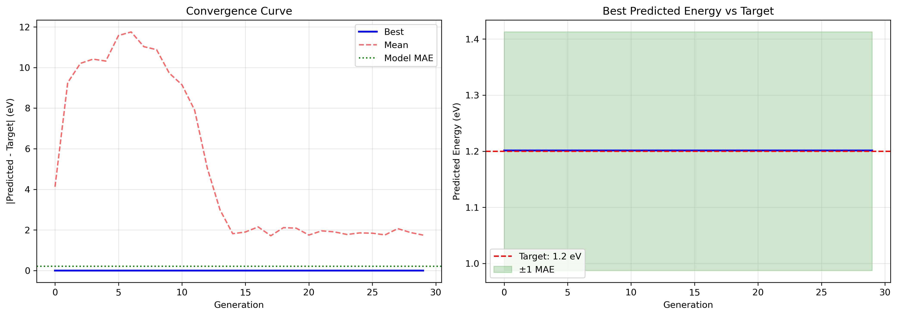

# ML-Guided Inverse Design of OER Catalyst Compositions

This project explores a machine-learning workflow for oxygen evolution reaction (OER) catalyst discovery. The core idea is to train a regression model on adsorption/reaction-energy data, then use a genetic algorithm (GA) to search catalyst compositions whose predicted energetics are close to a target value.

The repository is organized as a cleaned showcase version of a larger exploratory course project. The original work was developed mainly in Jupyter notebooks; the reusable parts have been extracted into small Python modules and scripts.

## Project Snapshot

- **Goal:** screen catalyst compositions for promising OER reaction-energy targets.
- **Model:** XGBoost regression using elemental-property descriptors and coordination number.
- **Search:** genetic algorithm over composition space, with mutation, crossover, elitism, and coordination-number sweeps.
- **Dataset:** adsorption/reaction-energy data derived from O*/OH* reaction records, plus pseudo-labelled examples.
- **Current best benchmark:** top-feature XGBoost on the true + pseudo-labelled dataset gives **5-fold CV test R² = 0.8205 ± 0.0372** and **MAE = 0.2069 ± 0.0103 eV**.



## Repository Structure

```text
.
├── assets/                  # Figures from exploratory analysis and GA runs
├── data/
│   ├── processed/            # Feature tables used for model training
│   └── raw/                  # Raw/intermediate reaction-energy tables
├── notebooks/exploration/    # Original notebooks retained as research history
├── results/                  # Example GA outputs and model-comparison tables
├── scripts/
│   ├── train_xgb.py          # Reproduce the headline XGBoost CV benchmark
│   └── run_inverse_design.py # Run an example GA composition search
└── src/oer_inverse_design/   # Clean reusable feature + GA utilities
```

## Quick Start

Create an environment with the scientific Python stack:

```bash
pip install -r requirements.txt
```

Reproduce the model benchmark:

```bash
python scripts/train_xgb.py
```

Run an example inverse-design search:

```bash
python scripts/run_inverse_design.py
```

The GA writes a ranked candidate table to:

```text
results/example_ga_candidates.csv
```

Example output from the cleaned search:

| Formula | CN | Predicted energy (eV) | Target error (eV) |
| --- | ---: | ---: | ---: |
| Ag4Rh | 1 | 1.1992 | 0.0008 |
| Ag4Au2Ru | 2 | 1.2009 | 0.0009 |
| Ag4Ru | 3 | 1.2011 | 0.0011 |
| Ag5Ni4Pd | 1 | 1.1978 | 0.0022 |
| Au2Cu3Ni4 | 1 | 1.1974 | 0.0026 |

These are **model-screened candidates**, not validated catalysts. They should be interpreted as hypotheses for follow-up calculation or experiment.

## Method

1. **Data preparation:** O*/OH* reaction-energy records are merged with composition, facet, site, and coordination descriptors.
2. **Feature engineering:** each composition is mapped to weighted elemental descriptors such as group, d-count, melting point, radius, density, and electronegativity.
3. **Model selection:** several regressors were explored in notebooks; XGBoost gave the best balance of accuracy and interpretability for the current feature set.
4. **Inverse design:** the GA proposes formulas, evaluates all coordination numbers from 1 to 4, and ranks candidates by absolute error from the target reaction energy.

## Results and Interpretation

The true + pseudo-labelled XGBoost model performs better than the true-only model on cross-validation:

| Dataset | Samples | Test R² | Test MAE |
| --- | ---: | ---: | ---: |
| True + pseudo-labelled | 1,406 | 0.8205 ± 0.0372 | 0.2069 ± 0.0103 eV |
| True-only | 569 | 0.7335 ± 0.0369 | 0.2813 ± 0.0282 eV |

This suggests pseudo-labelling improves coverage and apparent predictive power, but it also introduces label noise and should be validated carefully.

Additional descriptor/model experiments are summarized in [EXPERIMENT_RESULTS.md](EXPERIMENT_RESULTS.md). The best fair all-row benchmark reached **R² = 0.8251** and **MAE = 0.2026 eV** using numeric descriptors, formula element fractions, facet/site-family features, and a voting ensemble. For metallic/alloy-only training rows, the best XGBoost model improved from **R² = 0.7767** to **R² = 0.7957**.

## Limitations

- The dataset is relatively small for high-dimensional catalyst design.
- Some labels are pseudo-labelled, so model confidence is not equivalent to DFT or experimental validation.
- Composition-only descriptors cannot fully capture surface reconstruction, adsorption geometry, active-site identity, solvation, pH, or electrochemical potential.
- GA candidates can overfit the surrogate model and may include compositions that are synthetically unstable or phase-separating.

## Next Improvements

- Validate top GA candidates with DFT adsorption-energy calculations for O*, OH*, and OOH* intermediates.
- Add thermodynamic and Pourbaix stability filters before reporting candidates.
- Expand training data with OC20/OC22-style catalyst datasets or new Materials Project / OQMD-derived surfaces.
- Add uncertainty estimation through ensembles, conformal prediction, or Gaussian-process residual models.
- Constrain the GA with known synthesis and oxidation-state rules for oxides, alloys, and high-entropy catalysts.
- Add automated SHAP plots and parity plots to the training script.

## Notes

This is a research and portfolio project rather than a production screening tool. The cleaned code is meant to make the workflow readable, reproducible, and extensible while preserving the original notebook-based exploration.
